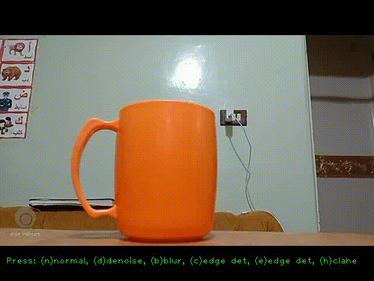

# video-processer-PYTHON_EDITION

A simple real-time image processing application built with **Python** and **OpenCV**.  
It captures video from your webcam and lets you switch between different processing modes on the fly using your keyboard.

---

## Features

- **Normal feed** – view the raw camera stream
- **Denoise** – apply median blur to reduce noise
- **Blur** – apply a simple box blur for smoothing
- **Canny Edge Detection** – detect edges in grayscale images
- **Corner Detection** – find and mark prominent corners
- **CLAHE (Contrast Limited Adaptive Histogram Equalization)** – normalize brightness and improve local contrast

---

## Controls

Press these keys during runtime to change the filter:

| Key | Mode |
|-----|------|
| `n` | Normal feed |
| `d` | Denoise (median blur) |
| `b` | Blur |
| `e` | Canny edge detection |
| `c` | Corner detection |
| `h` | CLAHE brightness normalization |
| `ESC` | Quit application |

---

*Developed by Mohammed Yasser Mohammed ;)* 

*email : es-mohamed.yasser2027@alexu.edu.eg* 

